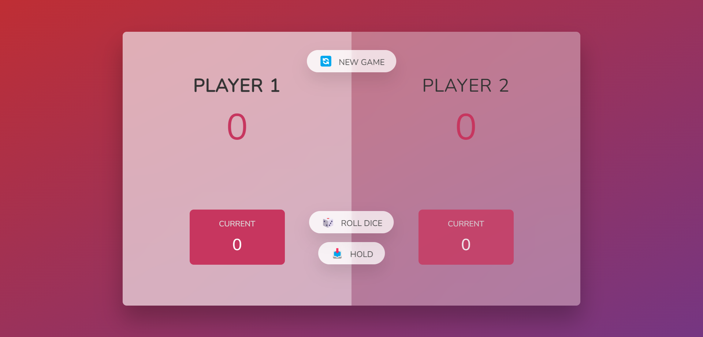

# Multiplayer Pig Game using JavaScript

Welcome to the Multiplayer Pig Game repository! This is a simple and entertaining game built using JavaScript, HTML, and CSS. The Pig Game, also known as "Pass the Pigs," challenges players to take turns rolling dice and accumulating points while avoiding certain risks.

##Game Rules
The game is played with 2 or more players.
Each player takes turns to roll a dice as many times as they want.
The current player's score increases with each dice roll, but if they roll a 1, their current score resets to 0 and it becomes the next player's turn.
Players can choose to 'Hold', which means their current score is added to their total score, and it becomes the next player's turn.
The first player to reach the set winning score wins the game.

##Features
Multiplayer: Play with your friends and family.
Interactive UI: Enjoy a visually appealing game interface.
Dice Rolling: Roll the dice and see your points accumulate.
Hold Option: Safely store your points and pass the dice to the next player.
Winner Declaration: The first player to reach the winning score is declared the winner.
##Project Structure
index.html: The main HTML file that displays the game interface.
style.css: The CSS file that styles the game interface.
script.js: The JavaScript file that contains the game logic and functionality.

##Acknowledgments
This game was inspired by traditional dice games and educational purposes.
The project structure and some code snippets may have been adapted from online tutorials and resources
